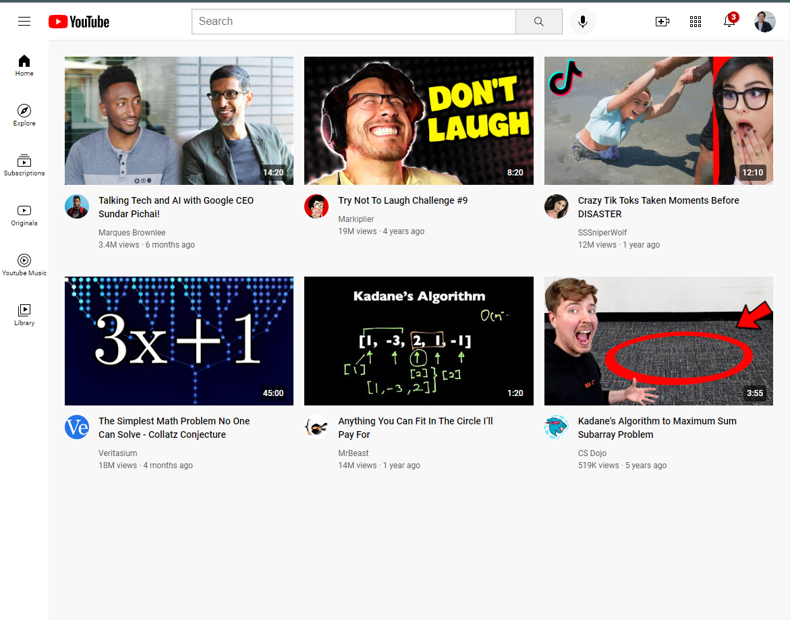

# HTML <i class="fa-brands fa-html5"></i> and CSS <i class="fa-brands fa-css3-alt"></i> practice

> - #### Used Flexbox
> - #### Used Css Grid
> - #### Used Semantic HTML
> - #### Exercised positioning
> - #### Exercised responsiveness

# Project Result
---

<link rel="stylesheet" href="https://cdnjs.cloudflare.com/ajax/libs/font-awesome/6.2.0/css/all.min.css" crossorigin="anonymous">
